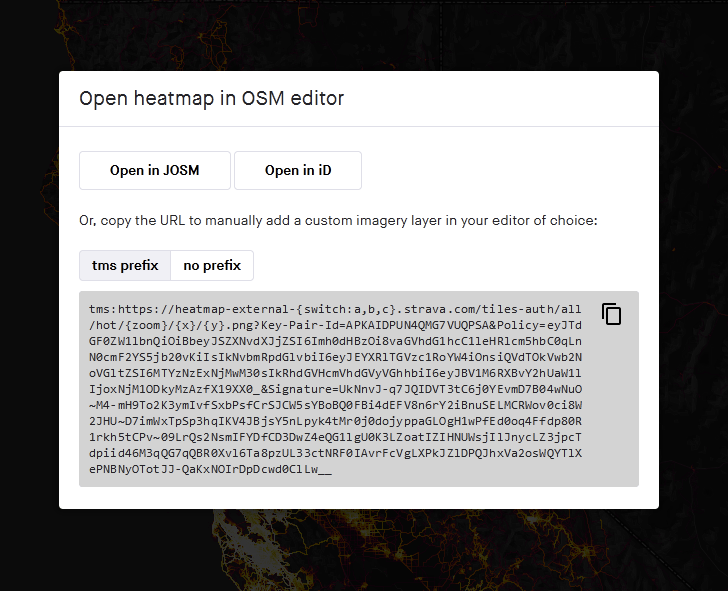

# JOSM Strava Heatmap

This browser extension makes it easy to use the [Strava Global Heatmap][1] in
[JOSM][2], [iD][8], and other mapping applications that support TMS imagery.

Accessing this imagery externally requires a set of key parameters that you obtain
by signing into the Strava website, copying the values from several cookies, and
then assembling into a query string at the end of the url.  The keys expire after a
week or so at which point you must repeat the process.  This extension builds the
url for you which makes this weekly process a bit less annoying.  

OSM Wiki: [Using the Strava Heatmap][3]

[1]: https://www.strava.com/heatmap
[2]: https://josm.openstreetmap.de/ "Java OpenStreetMap Editor"
[3]: https://wiki.openstreetmap.org/wiki/Strava
[8]: https://www.openstreetmap.org

## Installation

Available as a [Firefox Add-On][4] or [Chrome extension][7].  The Chrome extension
should also work in Microsoft Edge and other Chromium based browsers.

## Instructions

1. Visit [strava.com/heatmap][5] and log in – sign up for a free account if you don't have one
2. *Optional* - Select the heatmap color and activity type you want to use
3. Click the button pictured below to get the TMS imagery url prepopulated with the required
   `Key-Pair-Id`, `Policy`, and `Signature` parameters

4. Open the heatmap in your editor
   - Click the appropriate button to open the heatmap in either JOSM or iD.
     For [JOSM, Remote control][9] must be enabled
   - Alternatively you can copy the url (with or without the `tms:` prefix) and paste
     it into a custom imagery layer in you editor

[9]: https://josm.openstreetmap.de/wiki/Help/Preferences/RemoteControl

### Manually adding the imagery in JOSM

Copy the url without the `tms:` prefix.  Add a new TMS layer in the [JOSM imagery preferences][6].
Name it Strava Heatmap and paste in the copied url.  If you are updating an expired Strava Heatmap
layer you can just double-click it to replace url in the list view.  In this case, copy the url
*with* the `tms:` prefix as it is required here.

### Manually adding the imagery in iD

Copy the url without the `tms:` prefix.  Open the Backgrounds panel and select "Custom" at the bottom.
Paste the copied url into the Custom Background Settings window that opens.

[4]: https://addons.mozilla.org/en-US/firefox/addon/josm-strava-heatmap/
[5]: https://www.strava.com/heatmap
[6]: https://josm.openstreetmap.de/wiki/Help/Preferences/Imagery
[7]: https://chrome.google.com/webstore/detail/josm-strava-heatmap/hicmfobjcbinceoeegookkgllpdgkcdc
