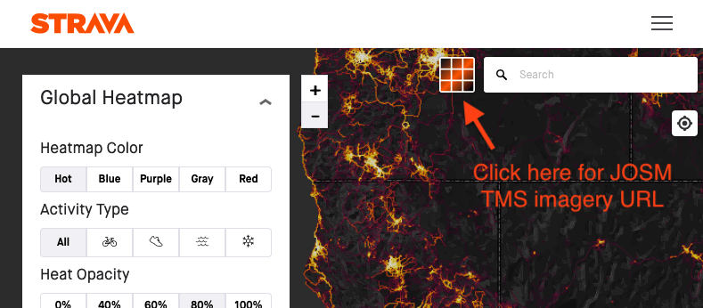

# JOSM Strava Heatmap

This browser extension adds a button to the [Strava Global Heatmap][1] that
copies the TMS imagery url for use in the [Java OpenStreetMap Editor][2] (JOSM).

Accessing this imagery externally requires a set of key parameters that you obtain
by signing into the Strava website, copying the values from several cookies, and
then assembling into a query string at the end of the url.  The keys expire after a
week or so at which point you must repeat the process.  This extension builds the
url for you which makes this weekly process a bit less annoying.  

[1]: https://www.strava.com/heatmap
[2]: https://josm.openstreetmap.de/
[3]: https://wiki.openstreetmap.org/wiki/Strava

