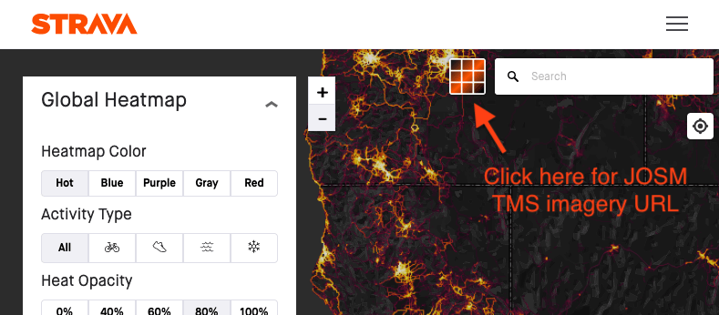
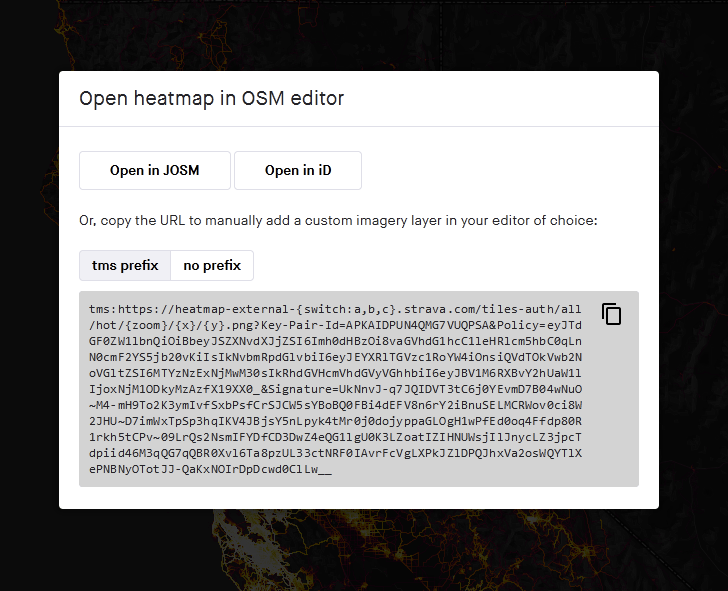

# JOSM Strava Heatmap

This browser extension makes it easy to use the [Strava Global Heatmap][1] in
[JOSM][2].

Accessing this imagery externally requires a set of key parameters that you obtain
by signing into the Strava website, copying the values from several cookies which 
must be included with imagery requests from JOSM in a custom header.  The keys expire 
frequently and the process must be repeated.  This extension gathers the url and cookie
values automatically so you can quickly open the imagery in JOSM.

This extension used to also allow for opening the imagery as a background in the iD Editor.
The cookie requirement for imagery access makes this no longer possible.  Thankfully 
[julcnx/strava-heatmap-extension][10] now extends the iD editor itself, 
adding the heatmap as an overlay.

OSM Wiki: [Using the Strava Heatmap][3]

[1]: https://www.strava.com/heatmap
[2]: https://josm.openstreetmap.de/ "Java OpenStreetMap Editor"
[3]: https://wiki.openstreetmap.org/wiki/Strava
[8]: https://www.openstreetmap.org
[10]: https://github.com/julcnx/strava-heatmap-extension

## Installation

Available as a [Firefox Add-On][4] or [Chrome extension][7].  The Chrome extension
should also work in Microsoft Edge and other Chromium based browsers.

## Instructions

1. Visit [strava.com/heatmap][5] and log in – sign up for a free account if you don't have one
2. *Optional* - Select the heatmap color and activity type you want to use
3. Click the button pictured below

4. Click the Open in JOSM button ([JOSM, Remote control][9] must be enabled)

[9]: https://josm.openstreetmap.de/wiki/Help/Preferences/RemoteControl

### Manually adding the imagery in JOSM

Copy the url without the `tms:` prefix.  Add a new TMS layer in the [JOSM imagery preferences][6].
Name it Strava Heatmap and paste in the copied url.  If you are updating an expired Strava Heatmap
layer you can just double-click it to replace url in the list view.  In this case, copy the url
*with* the `tms:` prefix as it is required here.

[4]: https://addons.mozilla.org/en-US/firefox/addon/josm-strava-heatmap/
[5]: https://www.strava.com/heatmap
[6]: https://josm.openstreetmap.de/wiki/Help/Preferences/Imagery
[7]: https://chrome.google.com/webstore/detail/josm-strava-heatmap/hicmfobjcbinceoeegookkgllpdgkcdc
